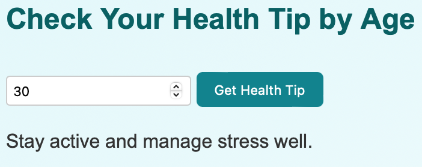
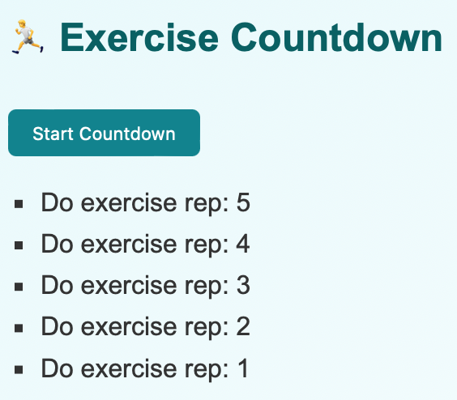
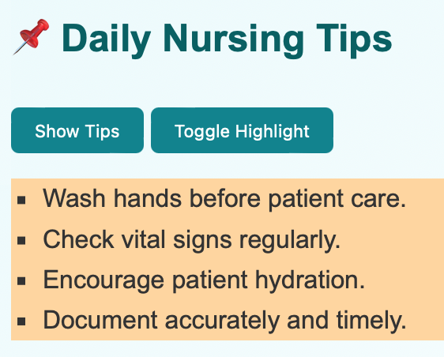
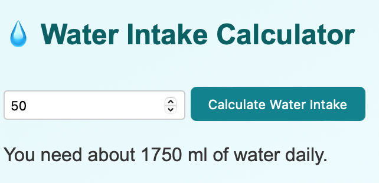

# 🚀 Assignment: Mastering JavaScript Fundamentals

Welcome to your next step toward JavaScript mastery! In this assignment, you'll explore essential concepts that form the backbone of interactive, dynamic web pages—functions, loops, and the Document Object Model (DOM). Ready to code like a pro? Let’s dive in.

---

## 🎯 Part 1: Mastering JavaScript Basics

Start with the building blocks of JavaScript—variables, data types, operators, and conditionals. You’ll write a few simple programs that capture user input, make decisions using `if/else`, and output results using `console.log()` or by modifying the webpage content.

**Goal:** Demonstrate your understanding of how JavaScript flows, processes logic, and interacts with data.

---

## ❤️ Part 2: JavaScript Functions — The Heart of Reusability

Functions are your best friends in programming. Write a few custom functions that take inputs, process them, and return or display results. You’ll also create functions for common tasks (like calculating totals, formatting strings, or toggling content).

**Goal:** Build reusable blocks of logic that make your code cleaner, smarter, and DRY (Don't Repeat Yourself).

---

## 🔁 Part 3: JavaScript Loops — Embrace the Power of Repetition!

Use `for`, `while`, or `forEach` loops to solve repetitive tasks like iterating through arrays, generating dynamic content, or simulating simple countdowns or animations.

**Goal:** Practice controlling flow with repetition and iteration—key to working with lists, animations, and form elements.

---

## 🌐 Part 4: Mastering the DOM with JavaScript

It’s time to bring your page to life! Use JavaScript to select elements, respond to user actions, and dynamically update the content of your web page. Tasks may include changing text, toggling classes, listening to click events, or creating elements on the fly.

**Goal:** Show your skill in making a static HTML page interactive using pure JavaScript and DOM manipulation.

---

## Deliverables

* A single project folder containing:

  * `index.html` — your structured HTML content
  * `style.css` — (optional) if you'd like to style your content
  * `script.js` — your JavaScript file including:

    * Variable declarations and conditionals (Part 1)
    * At least 2 custom functions (Part 2)
    * At least 2 loop examples (Part 3)
    * At least 3 DOM interactions (Part 4)

Each part of the assignment should be clearly commented and organized.

---

## Outcome

* Clear understanding of variables, conditionals, functions, loops, and DOM methods
* Code readability and comments explaining your logic
* Effective use of functions and loops to reduce repetition
* DOM manipulation that improves interactivity
* Clean structure and consistent indentation


================================================================================
================================================================================

# 📘 Student README - JavaScript Fundamentals Assignment — Health & Nursing Education

This project demonstrates **JavaScript fundamentals** (variables, conditionals, functions, loops, and DOM manipulation) in the context of **health and nursing education**.

---

## 📂 Project Structure

```
project-folder/
│── index.html # Main HTML file
│── style.css # CSS styling
│── script.js # JavaScript logic
│── screenshots/ # Screenshot folder
│ ├── homepage.png
│ ├── input-output.png
│ ├── functions-loops.png
│ └── dom-interaction.png
│── README.md # Project documentation

```

---

## 🚀 How to Run

1. Clone or download this project.  
2. Open `index.html` in any browser (Chrome, Edge, Firefox, etc.).  
3. Use the **buttons on the page** to test JavaScript features (tips, toggle highlight, loops).  

---

## 📑 Assignment Parts

### 🎯 Part 1: JavaScript Basics  

Captures user input with `prompt`, then checks age and gives a health tip using **conditionals**.  

```javascript
let age = prompt("Enter your age:");
if (age < 18) {
  console.log("Remember to stay active and eat healthy!");
} else {
  console.log("Maintain regular exercise and hydration.");
}
```

---

### ❤️ Part 2: Functions (Reusability)  

Two custom functions:  
- **calculateWaterIntake** → daily water intake by weight.  
- **showTips** → displays a list of health/nursing tips.  

```javascript
function calculateWaterIntake(weightKg) {
  return weightKg * 35; // ml of water per kg
}

function showTips() {
  const tips = [
    "Wash your hands regularly 🧼",
    "Drink enough water 💧",
    "Take study breaks 📚",
    "Get enough sleep 😴",
  ];
  const tipsList = document.getElementById("tipsList");
  tipsList.innerHTML = "";
  tips.forEach(tip => {
    const li = document.createElement("li");
    li.textContent = tip;
    tipsList.appendChild(li);
  });
}
```

---

### 🔁 Part 3: Loops (Repetition)  

**for loop**  

```javascript
for (let i = 5; i > 0; i--) {
  console.log("Do exercise rep: " + i);
}
```

➡️ This loop outputs repetitions directly to the **console**, simulating exercise reminders.  

---

### 🌐 Part 4: DOM Manipulation  

Includes 3 DOM interactions:  
1. **Show Tips** → dynamically displays nursing tips.  
2. **Toggle Highlight** → adds/removes background color on tips list.  
3. **Dynamic Element Creation** → new list items created in `showTips()`.  

```javascript
function toggleHighlight() {
  const tipsList = document.getElementById("tipsList");
  tipsList.classList.toggle("highlight");
}
```

---

## 🎨 Styling (style.css)  

Colorful background for presentation:  

```css
body {
  font-family: Arial, sans-serif;
  background: linear-gradient(to right, #e3f2fd, #fce4ec); /* light blue to pink */
  padding: 20px;
}

button {
  margin: 5px;
  padding: 8px 12px;
  border: none;
  border-radius: 8px;
  background-color: #4caf50;
  color: white;
  cursor: pointer;
}

button:hover {
  background-color: #388e3c;
}

.highlight {
  background-color: #fff59d; /* light yellow */
  transition: background-color 0.5s;
}
```

---

## 📸 Screenshots  

```html





```

---

## ✅ Learning Outcomes  

- Practiced **variables, conditionals, and operators**.  
- Built **reusable functions** for health tasks.  
- Implemented **loops** (exercise repetition in console).  
- Used **DOM manipulation** for interactivity.  
- Styled the page with **colorful CSS**.  
- Added **screenshots for demonstration**.  

---
@ 2025 Joseph - PLP Academy